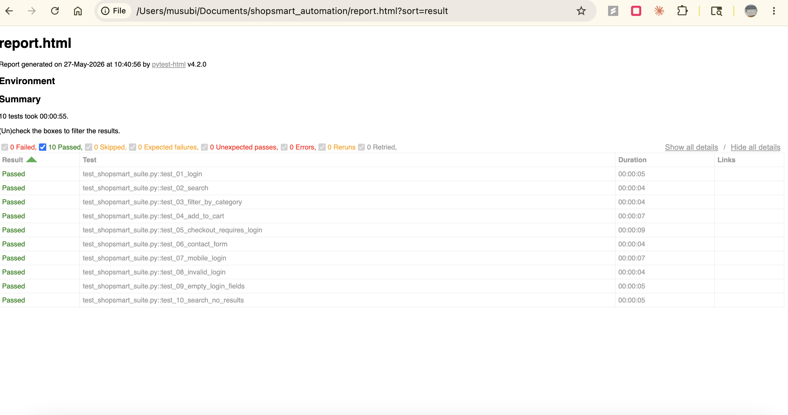

# ShopSmart QA Automation Suite

Playwright Python automation suite covering web and mobile testing 
for a full e-commerce platform.



## About This Project

ShopSmart is a simulated e-commerce platform used to demonstrate 
end-to-end QA automation skills. All scripts automate against 
[AutomationExercise.com](https://www.automationexercise.com) — 
a full-featured practice e-commerce site.

## Tools and Technologies

- Python 3.14
- Playwright
- pytest
- pytest-html (visual test reporting)
- Appium (native iOS testing)


## Test Coverage

| Test | Type | Description |
|------|------|-------------|
| test_01_login | Happy Path | Valid credentials — successful login |
| test_02_search | Happy Path | Search for a product — results display |
| test_03_filter_by_category | Happy Path | Filter by Women category |
| test_04_add_to_cart | Happy Path | Add product to cart — cart page loads |
| test_05_checkout_requires_login | Negative | Guest checkout redirects to login modal |
| test_06_contact_form | Happy Path | Submit contact form — success message |
| test_07_mobile_login | Mobile Web | iPhone 13 simulation — login flow |
| test_08_invalid_login | Negative | Wrong password — error message displays |
| test_09_empty_login_fields | Negative | Empty fields — form does not submit |
| test_10_search_no_results | Negative | No matching search term — empty results |
| test_11_ios_native | Native iOS | Appium XCUITest — footer navigation on iPhone 17 Simulator |

## How To Run

**Install dependencies:**
```
pip3 install playwright pytest pytest-html
playwright install
```

**Run the full suite:**
```
pytest test_shopsmart_suite.py -v
```

**Run with visual HTML report:**
```
pytest test_shopsmart_suite.py -v --html=report.html --self-contained-html
```

**Run individual scripts:**
```
pytest test_login.py -v
pytest test_mobile_login.py -v

**Run native iOS test (requires Appium running):**
pytest test_11_ios_native.py -v
```

## Test Report

Run the suite with the --html flag above to generate report.html. 
Open it in any browser to see full test results with pass/fail 
status and timing.

## Screen Recording

Every test run records video automatically — no changes to individual
test files required.

- **Playwright tests** (web + mobile web): `conftest.py` wraps every
  browser context with Playwright's built-in video recording. Each
  recording is saved to `recordings/` as `<test_name>_<timestamp>.webm`.
- **Native iOS test** (`test_11_ios_native.py`): uses Appium's
  `start_recording_screen()` / `stop_recording_screen()` around the
  test body. The result is decoded from base64 and saved to
  `recordings/ios_native_<timestamp>.mp4`.

**Disable video for a run:**
```
RECORD_VIDEO=0 pytest test_shopsmart_suite.py -v
```
(This only affects the Playwright tests — the iOS native test always
records, since Appium's screen recording has no per-run toggle here.)

Recording files themselves aren't committed (`recordings/*.webm` and
`recordings/*.mp4` are gitignored) — the `recordings/` folder is kept
in the repo via `.gitkeep` so it always exists locally.

## Project Structure

```
automation/
├── conftest.py                # Pytest fixture — enables video recording for Playwright tests
├── test_shopsmart_suite.py    # Full 10-test suite
├── test_login.py              # Login automation
├── test_search.py             # Search automation
├── test_add_to_cart.py        # Cart automation
├── test_contact_form.py       # Contact form automation
├── test_mobile_login.py       # Mobile web — iPhone 13 simulation
├── test_11_ios_native.py      # Native iOS — Appium XCUITest on iPhone 17 Simulator
├── recordings/                # Test run video recordings (gitignored contents)
└── report.html                # Latest test run results
```

## Author

Keoni Kakugawa — QA & Release Management Leader  
15+ years of QA and delivery experience  
github.com/keonikaku/automation
[LinkedIn](https://www.linkedin.com/in/keonikaku)
